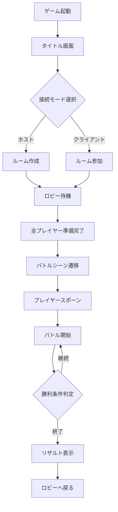

# ZeroGravity - VRサイバー空間バトルゲーム

ZeroGravity は **Photon Fusion** を活用した次世代VRマルチプレイヤー対戦ゲームです。サイバー空間を舞台に、重力から解放されたハイスピードバトルを体験できます。

## ゲーム概要

### 世界観
近未来のサイバー空間「ゼログラビティアリーナ」で、デジタル戦士たちが覇権を競う。重力の概念から解放された3次元バトルフィールドで、プレイヤーは最強のサイバー戦士を目指します。

### ゲームの特徴
- **完全3D空間戦闘**: 上下左右、あらゆる方向からの攻撃が可能
- **VR専用設計**: 直感的な操作で没入感のあるバトル体験
- **ハイスピードアクション**: テレポートやブーストを駆使した高速戦闘
- **戦略的なアビリティシステム**: アストラリンクエネルギーの管理が勝敗を分ける

## ゲームルール

### 基本ルール
- **プレイヤー数**: 2人（将来的に4人まで拡張予定）
- **勝利条件**: 
  - デスマッチ: 制限時間内に最も多くキルを取ったプレイヤーの勝利
  - チームデスマッチ: チーム合計キル数で勝敗を決定
- **試合時間**: 5分間（調整可能）
- **リスポーン**: 3秒後に自動リスポーン

### アビリティシステム
各ヒーローは固有のアビリティを持ち、戦況に応じて使い分けることが重要です。

#### 実装済みアビリティ
1. **Quantum Shift（クアンタムシフト）**
   - 瞬間移動で敵の攻撃を回避し、有利なポジションを取る
   - クールダウン: 3秒
   - 消費アストラリンク: 15

2. **Gravity Impact（グラビティインパクト）**
   - 重力波を発生させ、範囲内の敵に大ダメージ
   - クールダウン: 5秒
   - 消費アストラリンク: 25

3. **Plasma Shield（プラズマシールド）**
   - エネルギーシールドで一定時間ダメージを無効化
   - クールダウン: 8秒
   - 消費アストラリンク: 20

4. **Nano Wire Assault（ナノワイヤーアサルト）**
   - ナノワイヤーで敵を拘束し、継続ダメージを与える
   - クールダウン: 6秒
   - 消費アストラリンク: 30

### 戦闘システム
- **武器切り替え**: 3種類の武器を瞬時に切り替え可能
- **エイムアシスト**: VR特有の操作性を考慮した適度なアシスト
- **ダメージフィードバック**: 振動とビジュアルエフェクトで被弾を体感

## ゲームの面白さ

### 1. 無重力空間での立体的な戦闘
従来のFPSでは味わえない、上下左右すべての方向を活用した戦闘が可能。天井に張り付いての奇襲や、浮遊しながらの空中戦など、3次元空間を最大限に活用した戦術が求められます。

### 2. VRならではの直感的操作
- 実際に手を動かして武器を構える
- 頭の動きで周囲を確認
- 身体を使った回避行動
これらのVR特有の操作が、まるで本当にサイバー空間にいるような没入感を生み出します。

### 3. 戦略性の高いリソース管理
アストラリンクエネルギーは強力なアビリティの源。しかし無限ではないため、いつ・どのアビリティを使うかの判断が勝敗を分けます。単純な撃ち合いではなく、リソース管理という戦略要素が深みを与えています。

### 4. キャラクターの個性
各ヒーローが持つ固有アビリティにより、プレイスタイルが大きく変化。自分に合ったヒーローを見つけ、そのアビリティを極めることで、プレイヤーごとに異なる戦い方が生まれます。

## 動作環境
- **Unity 6 (6000.0.23f1)** 以上
- **.NET Standard 2.1**
- **対応 VR デバイス**: Meta Quest 2/3/Pro, HTC Vive, Valve Index, Pico 4

## セットアップ手順
1. リポジトリをクローンします。
   ```bash
   git clone <このリポジトリのURL>
   cd ZeroGravity
   ```
2. Unity Hub からプロジェクトを開きます。
3. Photon Fusion の App ID を設定します。（`Assets/Resources/PhotonAppSettings.asset`）
4. `Assets/07 Scenes/Main.unity` を起動してゲームを実行します。

## 主なフォルダ構成

```
Assets/
├── 03 Scripts/                # ゲームロジック全般
│   ├── Combat/                # 戦闘システム
│   │   ├── Abilities/         # アビリティ実装
│   │   ├── Weapons/           # 武器実装
│   │   └── Logic/             # 戦闘ロジック
│   ├── Core/                  # コアシステム
│   │   ├── Config/            # 設定管理
│   │   ├── Interfaces/        # インターフェース定義
│   │   ├── Logging/           # ログシステム
│   │   ├── Managers/          # 各種マネージャー
│   │   └── VR/                # VR関連処理
│   ├── Heroes/                # ヒーロー定義
│   ├── Management/            # ゲーム進行管理
│   │   └── GameRules/         # ゲームルール実装
│   ├── Networking/            # ネットワーク処理
│   │   ├── Data/              # ネットワークデータ構造
│   │   ├── Matchmaking/       # マッチメイキング
│   │   └── Services/          # ネットワークサービス
│   ├── Player/                # プレイヤー関連
│   │   ├── Commands/          # コマンドパターン実装
│   │   ├── Components/        # プレイヤーコンポーネント
│   │   └── Input/             # 入力処理
│   ├── UI/                    # UI全般
│   │   ├── Components/        # UIコンポーネント
│   │   ├── Game/              # ゲーム内UI
│   │   ├── Lobby/             # ロビーUI
│   │   └── VR/                # VR専用UI
│   ├── Utilities/             # ユーティリティ
│   │   ├── Extensions/        # 拡張メソッド
│   │   ├── Factories/         # ファクトリーパターン
│   │   └── Helpers/           # ヘルパークラス
│   └── Docs/                  # ドキュメント
├── 04 Prefabs/                # プレハブ
│   ├── Heroes/                # ヒーロープレハブ
│   ├── Weapons/               # 武器プレハブ
│   └── Effects/               # エフェクトプレハブ
├── 07 Scenes/                 # シーン
│   ├── Battle.unity           # バトルシーン（メイン）
│   ├── NewBattle.unity        # 新バトルシーン（開発中）
│   └── PV.unity               # プロモーション用シーン
├── Photon/                    # Photon関連
│   ├── Fusion/                # Fusion SDK
│   └── Resources/             # Photon設定
└── Resources/                 # リソース
    ├── Heroes/                # ヒーローデータ
    ├── Item/                  # アイテムデータ
    ├── Managers/              # マネージャープレハブ
    └── Rules/                 # ルールプレハブ
```

詳細なマッチメイキング設定は `Assets/03 Scripts/Networking/Matchmaking/README_Matchmaking.md` を参照してください。

## 技術的な特徴

### 最新の実装状況（2025年1月）

#### ✅ 完成済み機能
- **マルチプレイヤー対戦**: Photon Fusionによる低遅延同期
- **4つの固有アビリティ**: テレポート、グラビティインパクト、シールド、ナノワイヤー
- **ディゾルブエフェクト**: テレポート時のビジュアル演出
- **武器システム**: 3種類の武器を瞬時に切り替え
- **VR最適化**: 90FPSでの安定動作を実現

#### 🚧 開発中機能
- **マッチメイキングシステム**: スキルベースマッチング
- **ランキングシステム**: グローバルランキング
- **追加ヒーロー**: 新たな固有アビリティを持つキャラクター
- **カスタマイズ機能**: 武器スキン、エフェクトのカスタマイズ

### アーキテクチャの特徴

#### 権限管理と責任分離
本プロジェクトでは、ネットワーク権限チェックを **PlayerManager** で一元管理する設計を採用しています：

##### 設計思想
- **PlayerManager**: 中央オーケストレーターとして、権限チェックを一元化
- **武器・アビリティ**: 純粋な機能実装に集中（権限チェック不要）
- **明確な責任分離**: 単一責任の原則（SRP）に基づく設計

##### 実装パターン
```csharp
// 通常の武器発射パターン
// PlayerManager - 権限チェックとローカル実行
if (!HasInputAuthority) return;
weapon.Fire(XRNode.RightHand);        // ローカル実行
RPC_FireWeapon(true);                  // 他クライアントへ通知

// Weapon - 権限チェック不要、機能実装のみ
public void Fire() {
    // 純粋な発射ロジック
}
```

##### 特殊ケース: テレポートの実装
テレポートのようなネットワーク同期が必須のアビリティでは、PlayerManagerが直接RPCを呼びます：

```csharp
// PlayerManager - QuantumShiftの特別処理
if (movementAbility is QuantumShift quantumShift) {
    var targetPosition = quantumShift.CalculateTargetPosition();
    quantumShift.RPC_RequestTeleport(targetPosition);  // RPCを直接呼ぶ
}
```

この設計により、各クラスは自身の責任に集中でき、ネットワーク権限の複雑さはPlayerManagerが吸収します。

#### パフォーマンス最適化
- **オブジェクトプーリング**: 弾丸やエフェクトの再利用
- **LODシステム**: 距離に応じた描画品質の自動調整
- **非同期ローディング**: シーン遷移時のフレームレート維持

### 使用技術スタック
- **ゲームエンジン**: Unity 6 (6000.0.23f1)
- **ネットワーク**: Photon Fusion 2.0.6
- **VRフレームワーク**: Unity XR Interaction Toolkit 3.0.8
- **UI**: Unity UI Toolkit + Curved UI for VR
- **オーディオ**: Unity Audio + Spatial Audio

## ゲームフローとシステム連携

### ゲーム全体のフロー


### 主要クラスの連携フロー

#### 1. ネットワーク接続フロー
```
NetworkConnectionManager
    ├── PhotonFusion接続管理
    ├── セッション作成/参加
    └── 切断処理

NetworkService
    ├── プレイヤー管理
    ├── RPC通信制御
    └── 同期データ管理
```

#### 2. 戦闘システムフロー
```
PlayerManager（権限管理）
    ├── PlayerCombatController
    │   ├── 武器切り替え制御
    │   ├── 射撃入力処理
    │   └── アビリティ実行制御
    │
    ├── Weapon（武器実装）
    │   ├── NeoBlaster（レーザー）
    │   ├── ShadowSlinger（実弾）
    │   └── QuantumCure（回復）
    │
    └── Ability（アビリティ実装）
        ├── QuantumShift（瞬間移動）
        ├── GravityImpact（範囲攻撃）
        ├── PlasmaShield（防御）
        └── NanoWireAssault（拘束）
```

#### 3. ゲーム進行管理フロー
```
GameStateManager
    ├── ゲーム状態遷移
    ├── タイマー管理
    └── 勝利条件判定

BattleManager
    ├── スポーン管理
    ├── キル/デス記録
    └── リスポーン処理

GameRuleManager
    ├── EliminationRule（デスマッチ）
    └── TeamBattleRule（チーム戦）※開発中
```

#### 4. 入力処理フロー
```
PlayerInputHandler（VR入力統合）
    ├── XRIDefaultInputActions
    │   ├── コントローラー入力
    │   ├── ハンドトラッキング
    │   └── 視線入力
    │
    └── HandAccelerationDetection
        └── ジェスチャー認識
```

詳細なアーキテクチャ設計については以下のドキュメントを参照してください：
- アーキテクチャ概要: `Assets/03 Scripts/Docs/01_architecture-overview.md`
- ネットワーク設計: `Assets/03 Scripts/Docs/03_network-architecture.md`
- マッチメイキング: `Assets/03 Scripts/Networking/Matchmaking/README_Matchmaking.md`
