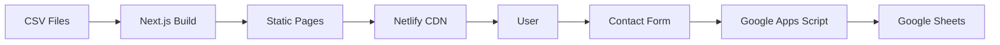
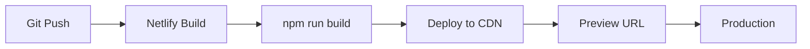

# 技術仕様書 (Architecture Design Document)

## テクノロジースタック

### 言語・ランタイム

| 技術 | バージョン | 選定理由 |
|------|-----------|----------|
| Node.js | 24.2.0 | 最新LTS、Next.js対応 |
| TypeScript | 5.9.x | 型安全性、開発効率向上 |

### フレームワーク・ライブラリ

| 技術 | バージョン | 用途 | 選定理由 |
|------|-----------|------|----------|
| Next.js | 15.4.x | フレームワーク | App Router、SSR/SSG、SEO最適化 |
| React | 19.1.x | UIライブラリ | 最新機能、コンポーネント設計 |
| Tailwind CSS | 3.4.x | スタイリング | ユーティリティファースト、高速開発 |
| Framer Motion | 12.x | アニメーション | 宣言的、React統合 |
| GSAP | 3.x | スクロールアニメーション | ScrollTrigger、高度な制御 |
| Three.js | 0.182.x | 3D表示 | WebGL、3Dビジュアル |
| Lenis | 1.x | スムーススクロール | 滑らかなスクロール体験 |
| i18next | 25.x | 多言語対応 | 柔軟な翻訳管理 |
| react-i18next | 15.x | React i18n統合 | Hooks対応 |
| lucide-react | 0.5x | アイコン | 軽量、カスタマイズ可能 |
| tsparticles | 3.x | パーティクル背景 | パフォーマンス最適化済み |

### 開発ツール

| 技術 | バージョン | 用途 | 選定理由 |
|------|-----------|------|----------|
| Playwright | 1.57.x | E2Eテスト | クロスブラウザ対応 |
| ESLint | 9.x | Linter | コード品質維持 |
| Sharp | 0.34.x | 画像最適化 | Next.js Image対応 |

### インフラ・外部サービス

| サービス | 用途 | 選定理由 |
|---------|------|----------|
| Netlify | ホスティング | 自動デプロイ、CDN、無料枠 |
| Google Apps Script | フォーム処理 | 無料、スプレッドシート連携 |
| Google Sheets | データ保存 | 無料、管理しやすい |
| Google Analytics 4 | アクセス解析 | 詳細な分析、無料 |
| LINE公式アカウント | 問い合わせ | 日本市場で普及 |

## アーキテクチャパターン

### JAMstackアーキテクチャ

```
┌─────────────────────────────────────────────────────────────┐
│                      CDN (Netlify)                          │
├─────────────────────────────────────────────────────────────┤
│                                                             │
│  ┌─────────────────────────────────────────────────────┐   │
│  │              Next.js Application                     │   │
│  │  ┌─────────────┐  ┌─────────────┐  ┌─────────────┐  │   │
│  │  │   Pages     │  │ Components  │  │   Hooks     │  │   │
│  │  │ (App Router)│  │  (React)    │  │  (Custom)   │  │   │
│  │  └─────────────┘  └─────────────┘  └─────────────┘  │   │
│  │                                                      │   │
│  │  ┌─────────────┐  ┌─────────────┐  ┌─────────────┐  │   │
│  │  │    i18n     │  │  API Routes │  │    Data     │  │   │
│  │  │  Provider   │  │  (/api/*)   │  │   (CSV)     │  │   │
│  │  └─────────────┘  └─────────────┘  └─────────────┘  │   │
│  └─────────────────────────────────────────────────────┘   │
│                                                             │
└─────────────────────────────────────────────────────────────┘
                              │
                              ▼
┌─────────────────────────────────────────────────────────────┐
│                    External Services                         │
│  ┌──────────────┐  ┌──────────────┐  ┌──────────────┐      │
│  │    GAS       │  │     GA4      │  │    LINE      │      │
│  │  (Forms)     │  │  (Analytics) │  │  (Contact)   │      │
│  └──────────────┘  └──────────────┘  └──────────────┘      │
└─────────────────────────────────────────────────────────────┘
```

### コンポーネントアーキテクチャ

```
┌─────────────────────────────────────────────────────────────┐
│                    Page Components                           │
│  (app/page.tsx, app/layout.tsx)                             │
├─────────────────────────────────────────────────────────────┤
│                   Section Components                         │
│  (HeroSection, ServicesSection, ContactSection, etc.)       │
├─────────────────────────────────────────────────────────────┤
│                    UI Components                             │
│  (Navigation, Footer, ContactForm, ServiceCard, etc.)       │
├─────────────────────────────────────────────────────────────┤
│                  Animation Components                        │
│  (AnimatedText, GlitchTitle, ParticleBackground, etc.)      │
├─────────────────────────────────────────────────────────────┤
│                    Provider Components                       │
│  (I18nProvider, LenisProvider, GoogleAnalytics)             │
└─────────────────────────────────────────────────────────────┘
```

## データ永続化戦略

### ストレージ方式

| データ種別 | ストレージ | フォーマット | 理由 |
|-----------|----------|-------------|------|
| サービス情報 | ローカルCSV | CSV | 管理しやすい、Git管理可能 |
| ニュース | ローカルCSV | CSV | 更新頻度低、静的生成 |
| FAQ | ローカルCSV | CSV | 更新頻度低、静的生成 |
| 翻訳データ | ローカルJSON | JSON | i18next標準形式 |
| お問い合わせ | Google Sheets | スプレッドシート | 外部保存、通知連携 |
| 言語設定 | localStorage | Key-Value | ブラウザ永続化 |

### データ更新フロー



## パフォーマンス要件

### レスポンスタイム

| 操作 | 目標時間 | 測定環境 |
|------|---------|---------|
| 初回ページ読み込み | 3秒以内 | 4G回線 |
| ナビゲーションスクロール | 即時 | - |
| フォーム送信 | 2秒以内 | 4G回線 |
| 言語切り替え | 100ms以内 | - |

### Core Web Vitals目標

| 指標 | 目標値 | 説明 |
|------|-------|------|
| LCP | 2.5秒以内 | Largest Contentful Paint |
| FID | 100ms以内 | First Input Delay |
| CLS | 0.1以下 | Cumulative Layout Shift |
| TTFB | 800ms以内 | Time to First Byte |

### 最適化戦略

- **画像最適化**: Next.js Image + Sharp
- **コード分割**: 動的インポート、React.lazy
- **フォント最適化**: next/font
- **プリロード**: 重要リソースのプリロード
- **キャッシュ**: 静的アセットの長期キャッシュ

## セキュリティアーキテクチャ

### データ保護

- **通信暗号化**: HTTPS強制（Netlify標準）
- **環境変数**: APIキー、シークレットの環境変数管理
- **機密情報**: .gitignore で除外、.env.local使用

### 入力検証

- **クライアント側**: リアルタイムバリデーション
- **サーバー側**: API Routeでの検証
- **サニタイゼーション**: XSS対策、HTMLエスケープ

### セキュリティヘッダー

```
# netlify.toml設定
X-Frame-Options: DENY
X-Content-Type-Options: nosniff
X-XSS-Protection: 1; mode=block
Referrer-Policy: strict-origin-when-cross-origin
```

## スケーラビリティ設計

### データ増加への対応

- **想定データ量**: ニュース100件、FAQ50件、サービス10件
- **パフォーマンス劣化対策**: ページネーション、仮想スクロール
- **アーカイブ戦略**: 古いニュースの別ページ化

### 機能拡張性

- **多言語拡張**: 翻訳JSONファイル追加で対応
- **サービス追加**: CSV行追加で対応
- **セクション追加**: コンポーネント追加で対応

### トラフィック対応

- **CDN**: Netlify CDNによる世界配信
- **静的生成**: SSGによる高速レスポンス
- **エッジキャッシュ**: 自動キャッシュ最適化

## テスト戦略

### E2Eテスト

- **フレームワーク**: Playwright
- **対象ブラウザ**: Chromium, Firefox, WebKit
- **テストシナリオ**:
  - ページ読み込み・表示テスト
  - ナビゲーション動作テスト
  - フォーム入力・バリデーションテスト
  - 多言語切り替えテスト
  - モバイル・タブレット表示テスト

### テスト実行

```bash
npm run test:e2e          # ヘッドレス実行
npm run test:e2e:ui       # UIモード
npm run test:e2e:headed   # ブラウザ表示
```

### カバレッジ目標

- E2Eテスト: 主要ユーザーフロー100%カバー
- 視覚回帰テスト: 検討中（将来実装）

## 技術的制約

### 環境要件

- **ブラウザ**: Chrome/Edge 90+, Firefox 90+, Safari 14+
- **JavaScript**: ES2020以上必須
- **WebGL**: Three.js使用のため必須

### パフォーマンス制約

- 3G回線では3D表示が重くなる可能性
- 古いデバイスではアニメーションがカクつく可能性

### 外部依存制約

- Google Apps Script: リクエスト制限あり
- Google Analytics: GDPR対応が必要な地域あり

## 依存関係管理

### プロダクション依存

| ライブラリ | 用途 | バージョン管理方針 |
|-----------|------|-------------------|
| next | フレームワーク | メジャー固定 (^15) |
| react | UI | メジャー固定 (^19) |
| tailwindcss | スタイリング | メジャー固定 (^3) |
| framer-motion | アニメーション | メジャー固定 (^12) |
| gsap | アニメーション | メジャー固定 (^3) |
| three | 3D | メジャー固定 (^0.182) |
| i18next | 多言語 | メジャー固定 (^25) |

### 開発依存

| ライブラリ | 用途 | バージョン管理方針 |
|-----------|------|-------------------|
| typescript | 型システム | メジャー固定 (^5) |
| @playwright/test | E2Eテスト | 最新追従 |
| eslint | Linter | 最新追従 |

### 更新方針

- **セキュリティパッチ**: 即座に適用
- **マイナーアップデート**: 月次で検討
- **メジャーアップデート**: 四半期ごとに検討、十分なテスト後に適用

## デプロイアーキテクチャ

### CI/CDパイプライン



### 環境構成

| 環境 | URL | 用途 |
|------|-----|------|
| Development | localhost:3000 | ローカル開発 |
| Preview | deploy-preview-*.netlify.app | PR確認 |
| Production | 本番ドメイン | 本番環境 |

### 環境変数

| 変数名 | 環境 | 説明 |
|--------|------|------|
| NEXT_PUBLIC_GAS_URL | 全環境 | GAS WebApp URL |
| NEXT_PUBLIC_GA_ID | Production | Google Analytics ID |
