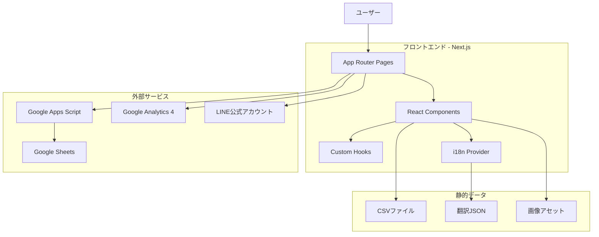
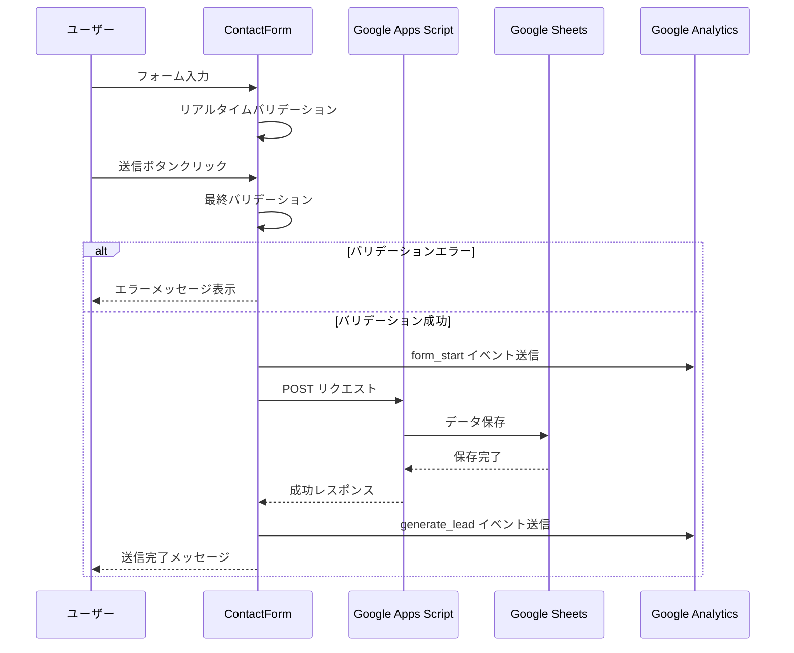
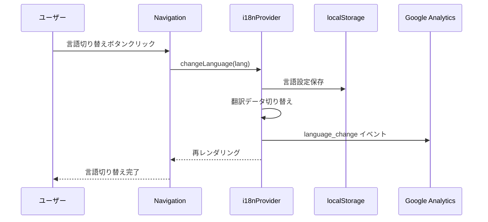
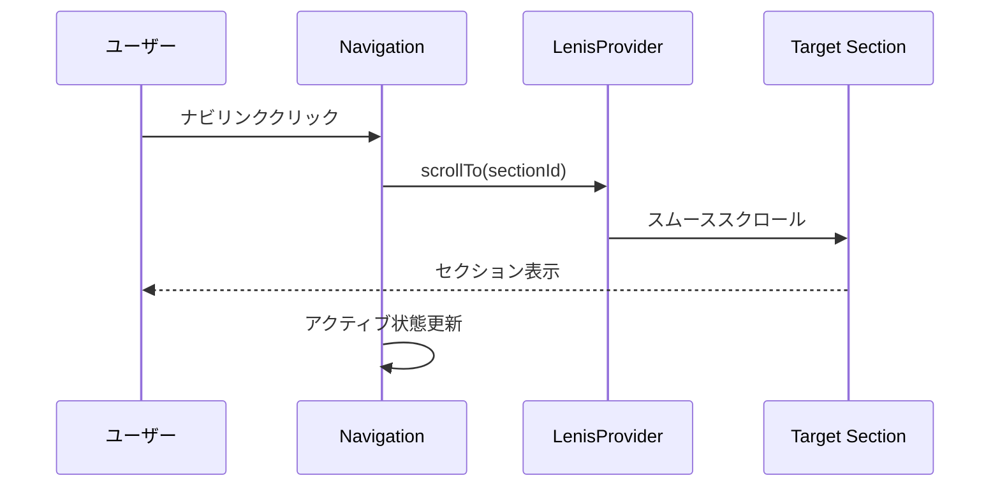
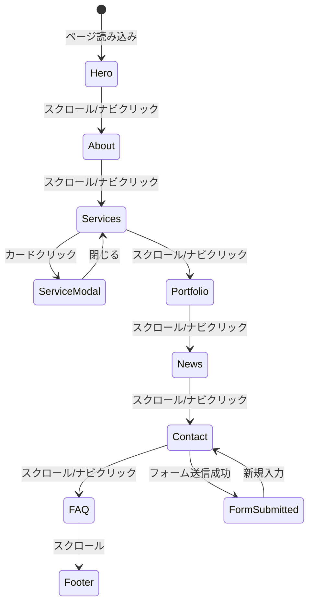

# 機能設計書 (Functional Design Document)

## システム構成図



## 技術スタック

| 分類 | 技術 | 選定理由 |
|------|------|----------|
| フレームワーク | Next.js 15.4 (App Router) | SSR/SSG対応、SEO最適化、React 19対応 |
| 言語 | TypeScript 5.9 | 型安全性、開発体験向上 |
| UI | React 19.1 | 最新機能、コンポーネント設計 |
| スタイリング | Tailwind CSS 3.4 | ユーティリティファースト、高速開発 |
| アニメーション | Framer Motion 12 | 宣言的アニメーション、React統合 |
| アニメーション | GSAP 3 (ScrollTrigger) | 高度なスクロールアニメーション |
| 3D | Three.js | 3Dビジュアル表現 |
| スクロール | Lenis | スムーススクロール |
| 多言語 | i18next / react-i18next | 柔軟な多言語対応 |
| テスト | Playwright | クロスブラウザE2Eテスト |
| デプロイ | Netlify | 自動デプロイ、CDN |

## データモデル定義

### エンティティ: Service（サービス）

```typescript
interface Service {
  id: string;                    // サービスID (例: "vr-ar")
  title: string;                 // サービス名
  description: string;           // 簡潔な説明
  details: string;               // 詳細説明
  icon: string;                  // アイコン名 (lucide-react)
  features: string[];            // 特徴リスト
}
```

### エンティティ: News（ニュース）

```typescript
interface News {
  id: string;                    // ニュースID
  date: string;                  // 日付 (YYYY-MM-DD)
  category: NewsCategory;        // カテゴリ
  title: string;                 // タイトル
  content: string;               // 内容
}

type NewsCategory = 'release' | 'update' | 'event' | 'media';
```

### エンティティ: FAQ

```typescript
interface FAQ {
  id: string;                    // FAQ ID
  category: FAQCategory;         // カテゴリ
  question: string;              // 質問
  answer: string;                // 回答
}

type FAQCategory = 'service' | 'pricing' | 'process' | 'technical';
```

### エンティティ: ContactForm（お問い合わせ）

```typescript
interface ContactFormData {
  name: string;                  // 名前（必須）
  email: string;                 // メールアドレス（必須）
  company?: string;              // 会社名（任意）
  category?: ServiceCategory;    // カテゴリ（任意）
  message?: string;              // ご要望・詳細（任意）
  budget?: BudgetRange;          // 予算（任意）
  deadline?: string;             // 希望納期（任意）
}

type ServiceCategory =
  | 'vr-prototype'
  | 'game-development'
  | 'ar-metaverse'
  | 'technical-support'
  | 'other';

type BudgetRange =
  | 'under-100k'
  | '100k-300k'
  | '300k-500k'
  | '500k-1m'
  | '1m-3m'
  | '3m-5m'
  | 'over-5m'
  | 'consultation';
```

### エンティティ: Testimonial（お客様の声）

```typescript
interface Testimonial {
  id: string;
  name: string;                  // 名前
  company: string;               // 会社名
  content: string;               // コメント
  rating: number;                // 評価 (1-5)
}
```

## コンポーネント設計

### ページコンポーネント

#### app/page.tsx

**責務**:
- 各セクションコンポーネントの統合
- 動的インポートによる遅延読み込み
- メタデータ設定

**依存関係**:
- HeroSection, AboutSection, ServicesSection, etc.

### セクションコンポーネント

#### HeroSection

**責務**:
- ファーストビューの表示
- Three.jsによる3D表示
- キャッチコピー表示

**Props**:
```typescript
interface HeroSectionProps {
  // 現状はpropsなし（i18nから取得）
}
```

#### ServicesSection

**責務**:
- サービスカードの一覧表示
- モーダルによる詳細表示
- アニメーション効果

**Props**:
```typescript
interface ServicesSectionProps {
  services: Service[];
}
```

#### ContactForm

**責務**:
- フォーム入力の管理
- バリデーション
- GASへの送信
- GA4イベント送信

**State**:
```typescript
interface ContactFormState {
  formData: ContactFormData;
  errors: Record<string, string>;
  isSubmitting: boolean;
  isSubmitted: boolean;
}
```

#### Navigation

**責務**:
- ナビゲーションメニュー表示
- スムーススクロール
- モバイルメニュー
- 言語切り替え
- アクティブセクション表示

**State**:
```typescript
interface NavigationState {
  isMenuOpen: boolean;
  activeSection: string;
  isScrolled: boolean;
}
```

### ユーティリティコンポーネント

#### I18nProvider

**責務**:
- 多言語コンテキストの提供
- 言語切り替え機能
- 言語設定の永続化

#### LenisProvider

**責務**:
- スムーススクロールの提供
- スクロール制御

## ユースケース図

### お問い合わせフォーム送信



### 言語切り替え



### セクションナビゲーション



## 画面遷移図



## API設計

### POST /api/contact

**リクエスト**:
```json
{
  "name": "山田太郎",
  "email": "yamada@example.com",
  "company": "株式会社サンプル",
  "category": "vr-prototype",
  "message": "VRプロトタイプの開発について相談したいです",
  "budget": "1m-3m",
  "deadline": "3ヶ月以内"
}
```

**レスポンス（成功）**:
```json
{
  "success": true,
  "message": "送信が完了しました"
}
```

**エラーレスポンス**:
- 400 Bad Request: バリデーションエラー
- 500 Internal Server Error: GAS連携エラー

### GET /api/news

**レスポンス**:
```json
{
  "news": [
    {
      "id": "1",
      "date": "2025-01-15",
      "category": "release",
      "title": "新サービスリリース",
      "content": "..."
    }
  ]
}
```

### GET /api/faq

**レスポンス**:
```json
{
  "faq": [
    {
      "id": "1",
      "category": "service",
      "question": "開発期間はどのくらいですか？",
      "answer": "..."
    }
  ]
}
```

## UI設計

### カラーパレット

| 用途 | カラー | Tailwind Class |
|------|--------|----------------|
| プライマリ | シアン | `cyan-400`, `cyan-500` |
| 背景（暗） | ダークグレー | `gray-900`, `gray-950` |
| 背景（明） | ライトグレー | `gray-100`, `white` |
| テキスト | 白/グレー | `white`, `gray-300` |
| アクセント | パープル | `purple-500` |
| 成功 | グリーン | `green-500` |
| エラー | レッド | `red-500` |

### ブレイクポイント

| サイズ | 幅 | 用途 |
|--------|-----|------|
| sm | 640px | スマートフォン横 |
| md | 768px | タブレット |
| lg | 1024px | 小型デスクトップ |
| xl | 1280px | デスクトップ |
| 2xl | 1536px | 大型デスクトップ |

### アニメーション設計

| トリガー | 効果 | ライブラリ |
|----------|------|-----------|
| ページ読み込み | フェードイン | Framer Motion |
| スクロール | パララックス | GSAP ScrollTrigger |
| ホバー | スケール/グロー | Tailwind/Framer |
| モーダル | スライドイン | Framer Motion |

## ファイル構造

### データファイル

```
data/
├── csv/
│   ├── ja/
│   │   ├── services.csv
│   │   ├── news.csv
│   │   ├── faq.csv
│   │   └── testimonials.csv
│   └── en/
│       ├── services.csv
│       ├── news.csv
│       ├── faq.csv
│       └── testimonials.csv
```

### 翻訳ファイル

```
public/
└── locales/
    ├── ja/
    │   └── common.json
    └── en/
        └── common.json
```

## パフォーマンス最適化

- **画像最適化**: Next.js Image コンポーネント使用
- **コード分割**: 動的インポートによる遅延読み込み
- **フォント最適化**: next/font によるフォント最適化
- **キャッシュ**: 静的アセットのブラウザキャッシュ
- **プリロード**: 重要リソースのプリロード

## セキュリティ考慮事項

- **入力サニタイズ**: フォーム入力のエスケープ処理
- **HTTPS**: 全通信のHTTPS化
- **環境変数**: APIキーの環境変数管理
- **CORS**: 適切なCORS設定
- **CSP**: Content Security Policy の設定

## エラーハンドリング

### エラーの分類

| エラー種別 | 処理 | ユーザーへの表示 |
|-----------|------|-----------------|
| フォームバリデーション | 送信をブロック | フィールド下にエラーメッセージ |
| GAS送信エラー | リトライ提案 | 「送信に失敗しました。再度お試しください」 |
| ネットワークエラー | オフライン検知 | 「インターネット接続を確認してください」 |
| 404 | カスタム404ページ | 「ページが見つかりません」 |

## テスト戦略

### E2Eテスト（Playwright）

- ページ読み込みテスト
- ナビゲーションテスト
- フォームバリデーションテスト
- 言語切り替えテスト
- モバイル表示テスト
- レスポンシブテスト

### テストファイル構成

```
e2e/
├── home.spec.ts          # ホームページ基本テスト
├── navigation.spec.ts    # ナビゲーションテスト
├── i18n.spec.ts          # 多言語テスト
├── services.spec.ts      # サービスセクションテスト
├── contact-form.spec.ts  # フォームテスト
├── news-faq.spec.ts      # ニュース・FAQテスト
├── cta-footer.spec.ts    # CTA・フッターテスト
└── mobile.spec.ts        # モバイル対応テスト
```
