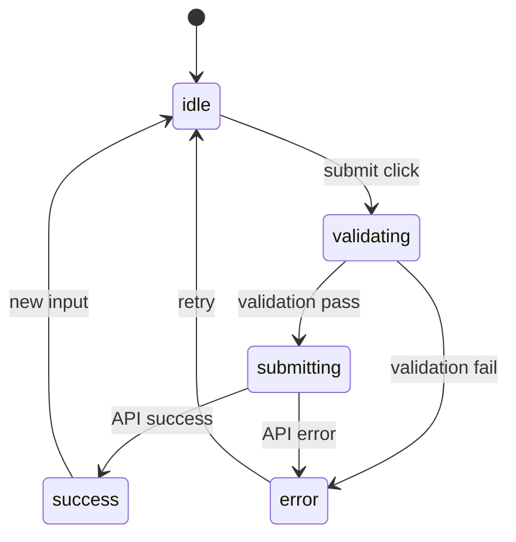

# プロジェクト用語集 (Glossary)

## 概要

このドキュメントは、RYURYU GAME FACTORY ホームページプロジェクト内で使用される用語の定義を管理します。

**更新日**: 2025-12-30

## ドメイン用語

プロジェクト固有のビジネス概念や機能に関する用語。

### VR（Virtual Reality）

**定義**: 仮想現実。コンピュータによって生成された3D空間に没入する技術

**説明**: ヘッドマウントディスプレイ（HMD）を装着し、視覚・聴覚を通じて仮想空間を体験する。Meta Quest、PlayStation VRなどのデバイスで利用可能。

**関連用語**: AR, MR, XR, メタバース

**使用例**:
- VRゲーム開発
- VRプロトタイプ制作
- VR展示会向けコンテンツ

**英語表記**: Virtual Reality

### AR（Augmented Reality）

**定義**: 拡張現実。現実世界にデジタル情報を重ねて表示する技術

**説明**: スマートフォンやARグラスを通じて、現実の風景にCGや情報を合成して表示する。ポケモンGOやIKEAのARアプリが代表例。

**関連用語**: VR, MR, XR

**使用例**:
- ARフィルター開発
- AR展示アプリ
- 位置情報連動ARコンテンツ

**英語表記**: Augmented Reality

### メタバース

**定義**: 仮想空間上で社会活動を行えるデジタルプラットフォーム

**説明**: 複数ユーザーがアバターを通じて交流、イベント参加、ビジネス活動を行える仮想空間。ClusterやVRChatが代表的なプラットフォーム。

**関連用語**: VR, Cluster, アバター

**使用例**:
- メタバースイベント空間制作
- バーチャル展示会

**英語表記**: Metaverse

### Cluster（クラスター）

**定義**: 日本発のメタバースプラットフォーム

**説明**: PC、スマートフォン、VR機器から参加可能な仮想空間プラットフォーム。企業イベント、音楽ライブ、ゲームワールドなど多様なコンテンツを展開。

**関連用語**: メタバース, VR, ワールド

**使用例**:
- Clusterワールド制作
- Clusterイベント会場構築

**英語表記**: Cluster

### ポートフォリオ

**定義**: 制作実績をまとめた作品集

**説明**: 過去に手がけたプロジェクトの概要、スクリーンショット、使用技術などをまとめたもの。クライアントへの提案時や採用活動で使用。

**関連用語**: 実績, 制作事例

**使用例**:
- ポートフォリオセクション
- 制作実績一覧

**英語表記**: Portfolio

### リード

**定義**: 潜在顧客、見込み客

**説明**: サービスに興味を持ち、問い合わせや資料請求などのアクションを起こした個人・企業。営業活動のターゲットとなる。

**関連用語**: コンバージョン, CTA

**使用例**:
- リード獲得
- リード管理

**英語表記**: Lead

## 技術用語

プロジェクトで使用している技術・フレームワーク・ツールに関する用語。

### Next.js

**定義**: Reactベースのフルスタックフレームワーク

**公式サイト**: https://nextjs.org/

**本プロジェクトでの用途**: ホームページ全体のフレームワークとして使用。App Router、SSG、API Routesを活用。

**バージョン**: 15.4.x

**関連ドキュメント**: docs/architecture.md

### React

**定義**: ユーザーインターフェース構築のためのJavaScriptライブラリ

**公式サイト**: https://react.dev/

**本プロジェクトでの用途**: UIコンポーネントの構築、状態管理

**バージョン**: 19.1.x

**関連ドキュメント**: docs/functional-design.md

### TypeScript

**定義**: JavaScriptに静的型付けを追加したプログラミング言語

**公式サイト**: https://www.typescriptlang.org/

**本プロジェクトでの用途**: 全てのソースコードで使用。型安全性の確保。

**バージョン**: 5.9.x

**関連ドキュメント**: docs/development-guidelines.md

### Tailwind CSS

**定義**: ユーティリティファーストのCSSフレームワーク

**公式サイト**: https://tailwindcss.com/

**本プロジェクトでの用途**: 全てのスタイリングに使用。レスポンシブデザイン、ダークモード対応。

**バージョン**: 3.4.x

**関連ドキュメント**: docs/functional-design.md

### Framer Motion

**定義**: React向けの宣言的アニメーションライブラリ

**公式サイト**: https://www.framer.com/motion/

**本プロジェクトでの用途**: ページ遷移、モーダル、ホバーエフェクトなどのアニメーション

**バージョン**: 12.x

**関連ドキュメント**: docs/architecture.md

### GSAP

**定義**: 高性能なJavaScriptアニメーションライブラリ

**公式サイト**: https://greensock.com/gsap/

**本プロジェクトでの用途**: ScrollTriggerを使用したスクロール連動アニメーション

**バージョン**: 3.x

**関連ドキュメント**: docs/architecture.md

### Three.js

**定義**: WebGL向け3Dグラフィックスライブラリ

**公式サイト**: https://threejs.org/

**本プロジェクトでの用途**: ヒーローセクションの3Dビジュアル表現

**バージョン**: 0.182.x

**関連ドキュメント**: docs/architecture.md

### Lenis

**定義**: 軽量なスムーススクロールライブラリ

**公式サイト**: https://lenis.studiofreight.com/

**本プロジェクトでの用途**: サイト全体のスムーススクロール

**バージョン**: 1.x

**関連ドキュメント**: docs/functional-design.md

### i18next

**定義**: JavaScriptの国際化（i18n）フレームワーク

**公式サイト**: https://www.i18next.com/

**本プロジェクトでの用途**: 日本語/英語の多言語対応

**バージョン**: 25.x

**関連ドキュメント**: docs/functional-design.md

### Playwright

**定義**: クロスブラウザ対応のE2Eテストフレームワーク

**公式サイト**: https://playwright.dev/

**本プロジェクトでの用途**: 全セクションの自動E2Eテスト（Chromium, Firefox, WebKit）

**バージョン**: 1.57.x

**関連ドキュメント**: docs/development-guidelines.md

### Netlify

**定義**: 静的サイト・Jamstackアプリ向けホスティングサービス

**公式サイト**: https://www.netlify.com/

**本プロジェクトでの用途**: 本番環境のホスティング、自動デプロイ

**バージョン**: -

**関連ドキュメント**: docs/architecture.md

## 略語・頭字語

### GAS

**正式名称**: Google Apps Script

**意味**: Googleのクラウドベースのスクリプト言語。GoogleスプレッドシートやGmailなどのGoogle製品を自動化・拡張できる。

**本プロジェクトでの使用**: お問い合わせフォームのデータ送信先として使用。スプレッドシートへの自動保存を実現。

### GA4

**正式名称**: Google Analytics 4

**意味**: Googleの最新のアクセス解析ツール。イベントベースの計測モデルを採用。

**本プロジェクトでの使用**: ユーザー行動の分析、コンバージョン計測に使用。

### i18n

**正式名称**: Internationalization（国際化）

**意味**: 「i」と「n」の間に18文字あることから。ソフトウェアを複数の言語・地域に対応させること。

**本プロジェクトでの使用**: react-i18nextによる日本語/英語の多言語対応。

### SSR

**正式名称**: Server-Side Rendering

**意味**: サーバー側でHTMLを生成してクライアントに送信するレンダリング方式。

**本プロジェクトでの使用**: Next.jsのデフォルトレンダリング方式。SEO最適化に貢献。

### SSG

**正式名称**: Static Site Generation

**意味**: ビルド時に静的HTMLを生成するレンダリング方式。

**本プロジェクトでの使用**: ニュース、FAQ、サービス情報など更新頻度の低いコンテンツに適用。

### CDN

**正式名称**: Content Delivery Network

**意味**: 世界中に分散配置されたサーバーからコンテンツを配信するネットワーク。

**本プロジェクトでの使用**: Netlify CDNにより静的アセットを高速配信。

### CTA

**正式名称**: Call To Action

**意味**: ユーザーに特定のアクション（問い合わせ、購入など）を促すUI要素。

**本プロジェクトでの使用**: 固定CTAボタン、コンタクトセクションへの誘導。

### SEO

**正式名称**: Search Engine Optimization

**意味**: 検索エンジン最適化。Googleなどの検索結果で上位表示されるための施策。

**本プロジェクトでの使用**: メタタグ、JSON-LD、OGP、サイトマップなどを実装。

### OGP

**正式名称**: Open Graph Protocol

**意味**: SNSでURLがシェアされた際に表示される情報（タイトル、画像、説明）を定義するプロトコル。

**本プロジェクトでの使用**: Facebook、Twitterでシェアされた際の表示を最適化。

### LCP

**正式名称**: Largest Contentful Paint

**意味**: 最大コンテンツの描画時間。Core Web Vitalsの指標の一つ。

**本プロジェクトでの使用**: 目標値2.5秒以内。パフォーマンス最適化の指標。

### FID

**正式名称**: First Input Delay

**意味**: 最初の入力遅延。ユーザーの操作に対する応答時間。

**本プロジェクトでの使用**: 目標値100ms以内。

### CLS

**正式名称**: Cumulative Layout Shift

**意味**: 累積レイアウトシフト。ページ読み込み中のレイアウトのずれの総量。

**本プロジェクトでの使用**: 目標値0.1以下。

### E2E

**正式名称**: End-to-End

**意味**: エンドツーエンド。システム全体を通じたテスト手法。

**本プロジェクトでの使用**: Playwrightによる自動E2Eテスト。

### MVP

**正式名称**: Minimum Viable Product

**意味**: 実用最小限の製品。必要最低限の機能でリリースし、フィードバックを得る開発手法。

**本プロジェクトでの使用**: PRDで定義されたP0（必須）機能がMVP範囲。

## アーキテクチャ用語

システム設計・アーキテクチャに関する用語。

### JAMstack

**定義**: JavaScript, APIs, Markupの頭文字。静的サイトとAPI連携を組み合わせたアーキテクチャパターン。

**本プロジェクトでの適用**: Next.js + Netlify + GASの構成で実現。静的生成されたページとAPI連携によるフォーム送信。

**関連コンポーネント**: Next.js, Netlify, Google Apps Script

**図解**:
```
[User] --> [Netlify CDN] --> [Next.js Static Pages]
                                    |
                                    v
                             [GAS API] --> [Google Sheets]
```

### App Router

**定義**: Next.js 13以降で導入されたファイルベースのルーティングシステム

**本プロジェクトでの適用**: `app/`ディレクトリでページとAPIルートを管理。`page.tsx`, `layout.tsx`, `route.ts`などの規約に従う。

**関連コンポーネント**: app/page.tsx, app/layout.tsx, app/api/

### API Routes

**定義**: Next.jsのサーバーサイドAPIエンドポイント

**本プロジェクトでの適用**: `app/api/`ディレクトリ内で定義。お問い合わせ送信、データ取得に使用。

**関連コンポーネント**: app/api/contact/, app/api/news/, app/api/faq/

### Provider Pattern

**定義**: Reactのコンテキストを使用してアプリ全体に機能を提供するパターン

**本プロジェクトでの適用**: I18nProvider（多言語）、LenisProvider（スムーススクロール）

**関連コンポーネント**: components/I18nProvider.tsx, components/LenisProvider.tsx

## ステータス・状態

システム内で使用される各種ステータスの定義。

### フォーム送信状態

| ステータス | 意味 | 遷移条件 | 次の状態 |
|----------|------|---------|---------|
| idle | 初期状態（入力待ち） | - | validating |
| validating | バリデーション中 | 送信ボタンクリック | submitting / error |
| submitting | 送信中 | バリデーション成功 | success / error |
| success | 送信成功 | GASレスポンス正常 | idle（新規入力時） |
| error | エラー発生 | バリデーション/送信失敗 | idle（再試行時） |

**状態遷移図**:


### ニュースカテゴリ

| カテゴリ | 日本語 | 説明 |
|---------|--------|------|
| release | リリース | 新サービス・製品のリリース情報 |
| update | アップデート | 既存サービスの更新情報 |
| event | イベント | 出展・登壇などのイベント情報 |
| media | メディア | メディア掲載・取材情報 |

### FAQカテゴリ

| カテゴリ | 日本語 | 説明 |
|---------|--------|------|
| service | サービス | 提供サービスに関する質問 |
| pricing | 料金 | 費用・見積もりに関する質問 |
| process | プロセス | 開発の流れ・納期に関する質問 |
| technical | 技術 | 技術的な質問 |

## データモデル用語

データベース・データ構造に関する用語。

### Service

**定義**: 提供サービス情報を格納するエンティティ

**主要フィールド**:
- `id`: サービスID（例: "vr-ar"）
- `title`: サービス名
- `description`: 簡潔な説明
- `details`: 詳細説明
- `icon`: アイコン名（lucide-react）
- `features`: 特徴リスト

**関連エンティティ**: ContactFormData（category）

**データソース**: data/csv/ja/services.csv, data/csv/en/services.csv

### News

**定義**: ニュース・お知らせ情報を格納するエンティティ

**主要フィールド**:
- `id`: ニュースID
- `date`: 日付（YYYY-MM-DD）
- `category`: カテゴリ（release/update/event/media）
- `title`: タイトル
- `content`: 内容

**データソース**: data/csv/ja/news.csv, data/csv/en/news.csv

### FAQ

**定義**: よくある質問と回答を格納するエンティティ

**主要フィールド**:
- `id`: FAQ ID
- `category`: カテゴリ（service/pricing/process/technical）
- `question`: 質問
- `answer`: 回答

**データソース**: data/csv/ja/faq.csv, data/csv/en/faq.csv

### ContactFormData

**定義**: お問い合わせフォームの入力データ

**主要フィールド**:
- `name`: 名前（必須）
- `email`: メールアドレス（必須）
- `company`: 会社名（任意）
- `category`: カテゴリ（任意）
- `message`: ご要望・詳細（任意）
- `budget`: 予算（任意）
- `deadline`: 希望納期（任意）

**送信先**: Google Apps Script → Google Sheets

### Testimonial

**定義**: お客様の声・推薦コメントを格納するエンティティ

**主要フィールド**:
- `id`: ID
- `name`: 名前
- `company`: 会社名
- `content`: コメント
- `rating`: 評価（1-5）

**データソース**: data/csv/ja/testimonials.csv, data/csv/en/testimonials.csv

## エラー・例外

システムで定義されているエラーと例外。

### フォームバリデーションエラー

**発生条件**: 必須項目が未入力、またはメールアドレス形式が不正な場合

**対処方法**: 該当フィールドの下にエラーメッセージを表示。ユーザーに修正を促す。

**エラーメッセージ例**:
- 「名前を入力してください」
- 「メールアドレスを入力してください」
- 「正しいメールアドレスを入力してください」

### GAS送信エラー

**発生条件**: Google Apps Scriptへの送信が失敗した場合

**対処方法**: 「送信に失敗しました。再度お試しください。」と表示。コンソールにエラーログを出力。

**エラーコード**: 500 Internal Server Error

### ネットワークエラー

**発生条件**: インターネット接続が切断された状態でフォーム送信を試みた場合

**対処方法**: 「インターネット接続を確認してください」と表示。

## 参考リンク

- [プロダクト要求定義書](./product-requirements.md)
- [機能設計書](./functional-design.md)
- [アーキテクチャ設計書](./architecture.md)
- [リポジトリ構造定義書](./repository-structure.md)
- [開発ガイドライン](./development-guidelines.md)
